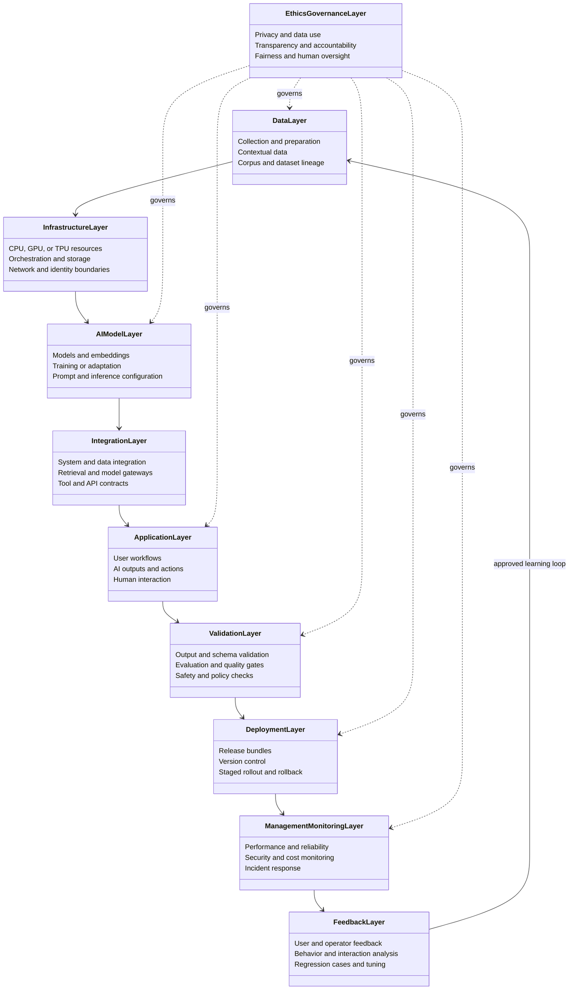

# Enterprise Reference Architecture: LLM and Agent Evaluation, CI/CD, and Observability

**Status:** Reference architecture / implementation template  
**Audience:** AI platform engineers, application teams, security, SRE, data governance, and release owners  
**Scope:** Retrieval-augmented generation (RAG), LLM applications, and tool-using agents  
**Note:** Examples, targets, field names, and thresholds in this document are illustrative. Adapt them to the application's risks, traffic, contractual commitments, and measured baseline; they are not universal standards.

## 1. Executive summary

Enterprise AI delivery needs two complementary controls: **pre-release evidence** that a candidate behaves acceptably on representative and adversarial tasks, and **production evidence** that it continues to behave acceptably under real traffic. Traditional software CI checks code and deterministic outcomes; AI delivery must additionally test prompts, model routing, retrieval corpora, tool contracts, nondeterministic responses, side effects, privacy boundaries, latency, and cost.

The reference architecture separates four concerns:

1. **Artifact and experimentation plane:** Version prompts, model routing, retrieval configuration, tool definitions, datasets, evaluators, and policies.
2. **Evaluation and release plane:** Run layered tests against a candidate, compare it to a known baseline, and require explicit promotion decisions.
3. **Runtime and serving plane:** Enforce identity, authorization, guardrails, budgets, tool permissions, and safe execution.
4. **Observability and feedback plane:** Trace real executions, detect regressions, investigate incidents, and curate confirmed failures into future evaluations.

The key architectural rule is that **a successful final answer is not sufficient evidence of a safe agent**. Evaluate the answer, the sources it used, the actions it took, and the resulting state.

## 2. Goals, non-goals, and principles

### Goals

- Establish repeatable evidence for correctness, groundedness, task completion, safety, and operational fitness.
- Make every production result attributable to the exact application release and effective AI configuration.
- Prevent unauthorized tool actions and isolate test side effects.
- Detect production failures quickly enough to pause, route around, or roll back a bad release.
- Turn confirmed failures into reviewed, reusable regression tests.

### Non-goals

- Guarantee zero hallucinations or make model outputs fully deterministic.
- Treat one judge score or embedding similarity score as proof of factual correctness.
- Auto-deploy a fine-tuned model solely because an automated benchmark improved.
- Assume logging full prompts and responses is acceptable for every data class.

### Design principles

- **Risk-weighted controls:** Approval and test rigor scale with the impact of wrong answers or actions.
- **Layered evidence:** Use deterministic assertions where possible; use human review and calibrated model judges for ambiguous cases.
- **Least privilege:** Tool permissions, data access, and execution scopes are narrow and independently enforced.
- **Reproducible releases:** Record effective configuration and stable artifact references, not only an application Git commit.
- **Fail safely:** On ambiguous authorization, unavailable evidence, or a tool outage, avoid fabricating results or executing a guessed action.
- **Privacy by design:** Minimize retained content and restrict access to sensitive traces and evaluation cases.

## 3. Reference architecture and data flows

**Authoring path:** Application team changes code, prompt, model routing, retrieval settings, or tool contract → registers candidate artifacts → runs local and CI evaluation → reviews differences against the production baseline → signs off → promotes the same immutable artifact bundle through staging and production.

**Serving path:** User request → authentication and policy checks → retrieval and/or agent planning → authorized tool calls → response validation → user-visible response. Each step emits correlated, policy-compliant telemetry.

**Feedback path:** Traces and feedback → triage and root-cause classification → de-identified, approved test case → regression dataset version → new candidate evaluation. Production examples do not enter training or testing automatically without data-use review.

### Layered implementation view

The following ten layers provide a system-design view that complements the four operational planes above. They describe logical responsibilities, not necessarily separate services or deployment units. A small application may implement several layers in one component; a platform may distribute one layer across several services.

#### Layer-to-control mapping

| Layer | Implementation responsibility | Example evidence | Primary plane |
| --- | --- | --- | --- |
| Data | Collect, prepare, authorize, version, and refresh source data and evaluation datasets | Corpus manifest, data lineage, ACL tests, retention decision | Artifact and experimentation |
| Infrastructure | Provide isolated, scalable, observable compute, storage, network, and identity services | Infrastructure definition, access policy, capacity and availability evidence | Runtime and serving |
| AI model | Select and configure models, embeddings, prompts, routes, and adaptation processes | Model resolution, prompt hash, inference configuration, model evaluation | Artifact and experimentation |
| Integration | Connect retrieval, model gateways, business systems, APIs, and tools through explicit contracts | API/tool schemas, contract tests, dependency assessment | Runtime and serving |
| Application | Implement user journeys, orchestration, output presentation, and authorized actions | Acceptance tests, UX review, authorization decisions, action audit | Runtime and serving |
| Validation | Verify correctness, groundedness, safety, schema compliance, and task or state completion | Evaluation report, security suite, judge calibration, approval gate | Evaluation and release |
| Deployment | Promote immutable bundles through environments with controlled rollout and rollback | Release manifest, canary record, rollback rehearsal | Evaluation and release |
| Management and monitoring | Operate the system and detect quality, security, reliability, latency, and cost regressions | Traces, dashboards, alerts, SLOs, incident records | Observability and feedback |
| Feedback | Triage signals and convert approved findings into regression cases and improvements | Review queue, incident classification, dataset change record | Observability and feedback |
| Ethics and governance | Set risk appetite, accountability, privacy, fairness, transparency, oversight, and exception rules | Risk assessment, decision record, impact review, exception approval | Cross-cutting across all planes |

#### Alignment notes and conflicts

- **Ethics and governance is not a terminal layer.** It constrains and reviews every layer, especially data use, model selection, validation, deployment, and monitoring. It is shown as cross-cutting rather than as the last step in a one-way pipeline.
- **Feedback is a loop, not an endpoint.** Feedback can change datasets, prompts, models, retrieval, controls, or product requirements. It must pass through triage, privacy review, and evaluation before influencing a release.
- **Validation occurs more than once.** The logical validation layer includes pre-release evaluation, runtime contract checks, authorization checks, and post-release quality review. It is not only a gate between application and deployment.
- **Security is cross-cutting.** Identity, authorization, secrets, isolation, supply-chain security, prompt injection resistance, and side-effect controls apply to infrastructure, data, integrations, applications, deployment, and operations; they are not limited to management and monitoring.
- **Deployment is broader than model hosting.** The release unit includes application code, prompts, model routes, retrieval and corpus versions, tool schemas, policies, guardrails, datasets, and evaluator versions.

### Plane responsibilities

| Plane | Primary components | Output |
| --- | --- | --- |
| Artifact and experimentation | Prompt registry, dataset registry, model-routing configuration, corpus manifest, tool schemas, evaluator versions | Versioned candidate bundle and evaluation manifest |
| Evaluation and release | Test runners, sandboxed fixtures, judges, result store, comparison reports, approval gates | Pass/fail evidence and promotion decision |
| Runtime and serving | API gateway, identity/policy enforcement, retriever, model gateway, agent orchestrator, tools, output validation | Response and authorized side effects |
| Observability and feedback | Tracing, metrics, alerting, sampling, review queue, incident workflow | Operational signals and curated regression cases |

A deployment should resolve to an **effective release manifest** containing application build, prompt/template hashes, model identifier or provider alias and resolved identifier when available, sampling parameters, retriever/index and corpus versions, tool schema versions, guardrail policy, evaluator-suite version, and rollout cohort. If a provider does not expose an immutable model snapshot, record the limitation and perform continuous compatibility checks.

## 4. Artifact and dataset management

### 4.1 Versioned artifacts

Version the following independently but promote them as a tested bundle: application code; system/developer prompts and templates; model and fallback routing; inference parameters; retrieval parsing, chunking, embeddings, index, corpus snapshot, and ranking; tool definitions and authorization policies; output contracts; guardrail rules; evaluation datasets; judge rubrics and judge model configuration.

Keep secrets outside prompt artifacts and release manifests. A prompt hash is useful for comparison but does not replace secure access to the exact approved template. Model aliases can move: capture both the requested alias and actual resolved model identifier if the provider supplies it.

### 4.2 Regression dataset design

Maintain distinct slices rather than one blended score:

- **Golden cases:** Human-reviewed, common business tasks with expected behavior and provenance.
- **Boundary cases:** Ambiguous, multilingual, long-context, missing-data, and conflicting-source requests.
- **Adversarial cases:** Direct and indirect prompt injection, data-exfiltration attempts, malicious tool responses, and unauthorized actions.
- **Historical failures:** Confirmed production issues with a documented fix and invariant.
- **Synthetic cases:** Newly generated variants reviewed for validity and labeled separately from real traffic.
- **Holdout cases:** Restricted-access cases not routinely used during prompt tuning to reduce overfitting.

Each case should record its task, initial state, permitted tools, source fixtures, expected assertions, severity, owner, approval/provenance, and applicable data-use constraints. For agents, record the expected **terminal environment state** and forbidden side effects, not merely an exact tool-call sequence.

Prevent train/test contamination where possible: track dataset lineage, segregate holdouts, and never publish confidential holdout answers into the prompt or optimization loop.

## 5. Evaluation architecture

### 5.1 Evaluation ladder

| Stage | Typical trigger | Example checks | Outcome |
| --- | --- | --- | --- |
| Local / pre-commit | Prompt, code, or schema edit | Template render, schema validation, small smoke set, unit tests | Fast developer feedback |
| Pull request CI | Candidate bundle change | Component tests, targeted regressions, mocked tool calls, security checks | Merge gate |
| Staging / pre-release | Approved candidate | Full dataset, sandbox agent tasks, calibrated judge review, load and failure injection | Release evidence |
| Progressive production | Limited cohort or shadow | Real-traffic latency, error rate, safety signals, sampled quality review | Expand, pause, or roll back |
| Continuous / scheduled | Corpus, traffic, or provider drift | Re-run holdouts, sample traces, replay incidents, inspect shifts | New issue or updated baseline |

Keep evaluator implementation and rubric versions stable during a comparison; if the evaluator changes, re-score both baseline and candidate. Pin tool fixtures and dataset snapshots for reproducibility. Run repeated trials for stochastic behaviors and report distribution and uncertainty, rather than assuming one sample is representative.

### 5.2 Retrieval relevance and groundedness

**Example:** A user asks, “What is the adoption leave policy?” The indexed policy has a section specifically for adoptive parents, while other retrieved chunks concern maternity leave and unrelated benefits.

- **Retrieval relevance:** Did the relevant policy chunk appear in the top results, and how high was it ranked? Evaluate by relevance judgments, recall at a chosen retrieval depth, and ranking quality on labeled queries.
- **Groundedness:** If the source states “eight weeks,” does the answer cite or accurately reflect that source? A claim of “twelve weeks” fails even if the answer sounds useful.
- **Answer relevance:** Does the response answer the adoption-leave question rather than summarizing general leave policy?
- **Citation validity:** Does each cited source actually support the attached claim and belong to the authorized corpus/version?
- **Authorization:** Does retrieval respect tenant, role, and document-level permissions? A relevant but unauthorized chunk is a security failure.

Test retrieval and generation separately so a missing document is not mistaken for a generation problem. Evaluate freshness and abstention when policy documents are missing or conflict.

### 5.3 Response correctness and hallucination testing

**Example:** A support assistant receives a question about an API tier. Its reference document says the standard tier supports 100 requests per minute and that enterprise limits are individually configured. An answer inventing a fixed enterprise limit fails the groundedness check.

Build case-level assertions for correct required facts, prohibited claims, source support, and appropriate uncertainty. Include **unanswerable** cases where the required evidence is absent. Use exact matching for stable identifiers or calculations, semantic comparison for paraphrased factual content, and claim-level evidence review for long answers. A model judge can prioritize review, but human-audited samples should measure false positives and false negatives of the judge.

Distinguish **incorrect**, **unsupported**, and **out-of-date** claims. These have different remedies: prompt/model adjustment, improved retrieval or abstention, and corpus refresh respectively. Do not use an arbitrary embedding similarity cutoff as the sole correctness gate.

### 5.4 Agent task completion and tool-call accuracy

**Example:** An agent must find a pull request with a failed check, read the failing test name, and post a comment on the correct pull request.

Evaluate four layers:

1. **Tool-call validity:** Is the selected tool allowed and is the call compliant with its actual schema?
2. **Argument correctness:** Are repository, pull request, and comment content derived from verified context, not invented?
3. **Trajectory safety and efficiency:** Did the agent avoid repeated loops, excess calls, unauthorized reads, or premature writes? A different valid call order can still pass.
4. **Terminal state:** In a test repository, does the correct comment exist exactly once on the intended pull request, with no unrelated changes?

Use mock/replay tools for fast CI checks and isolated integration environments for stateful tasks. Separate “tool unavailable” from “agent chose the wrong tool,” and explicitly test retries, timeouts, duplicate side effects, idempotency, approval gates, and recovery after partial failure.

### 5.5 Security, privacy, and robustness

Test prompt injection in retrieved documents, tool output, web pages, and user input; attempts to reveal secrets or cross tenant boundaries; unsafe tool parameters; content policy regressions; sensitive information disclosure; and over-refusal of legitimate requests. Use realistic fixtures with fake credentials and synthetic personal data. Treat external retrieved text as data, not as instructions with system-level authority.

An independent authorization layer must reject disallowed tool actions even if the model requests them. A model refusal alone is not a sufficient security boundary.

### 5.6 Performance, reliability, and cost

Load-test concurrent sessions, long contexts, retrieval fan-out, fallback routing, tool timeouts, and rate limiting. Measure end-to-end and component latency, time to first token for streaming, completion rate, tool retries, token use, and cost attribution. Compare candidate and baseline on the same workload; do not turn a noisy single-run latency result into an absolute gate.

## 6. CI/CD gates and release thresholds

Thresholds below are **example starting policies**, not industry-mandated values. Set final thresholds using risk assessment, production baseline, evaluator reliability, and statistical power.

| Gate | Illustrative policy | When it blocks |
| --- | --- | --- |
| Build and contract | All required templates render; all tool payloads in deterministic fixtures validate against the approved schema | Pull request |
| Access and side effects | Zero unauthorized reads/writes and zero forbidden side effects in the security suite | Pull request and staging |
| Agent completion | At least 90% of designated standard sandbox tasks reach the verified terminal state; no critical task regresses | Staging |
| Groundedness | At least 95% of reviewed claims on the labeled RAG set are supported; critical policy answers require separate review | Staging |
| Answer correctness | No regression in critical cases; overall score must not fall beyond an agreed tolerance versus baseline | Staging |
| Latency | Candidate p95 response time stays inside the application SLO under a representative load profile | Staging and canary |
| Production canary | Pause or roll back on sustained critical safety failure, error-rate breach, or clearly attributable severe quality regression | Production |

Document denominator, sampling method, evaluator confidence, owners, and exception handling for every gate. A “100%” result on a small test set is not a guarantee of perfect production behavior. Severity-based blockers should be explicit: a single unauthorized tool write may outweigh a small improvement in average answer quality.

A typical release sequence is: **change → validate artifacts → run targeted CI → full staging evaluations → compare with baseline → human approval where required → deploy shadow/canary → inspect metrics and sampled outputs → expand or roll back → archive evidence**. Shadow executions must suppress writes and other external side effects. Blue/green or feature-flag releases should retain a tested rollback bundle and a known method to restore index/configuration compatibility.

## 7. Runtime architecture and controls

Authenticate the caller and propagate identity through retrieval and tool access. Apply policy to every sensitive resource, not only at the initial prompt. Give agents bounded tool scopes, execution time limits, maximum steps, and per-run spending controls. For mutating actions, require idempotency protections and, when warranted by risk, human confirmation before execution.

Input processing may classify intent or detect known attacks, but blocking should be proportionate to false-positive cost. Validate structured responses before sending them downstream. If mandatory evidence is absent, the application should ask for clarification, explain uncertainty, or route to a human rather than fabricate an answer. On provider failure, a fallback model should preserve authorization and output contracts and be separately evaluated.

## 8. Production traces, latency, and failure monitoring

### 8.1 Trace structure and data handling

Correlate a user request with child operations such as retrieval, reranking, model invocation, guardrail evaluation, and tool execution. Record timestamps, status, retry count, effective release manifest, and stable identifiers for the relevant tenant/session under the organization's privacy policy. Log content only if authorized and necessary; prefer redacted payloads, hashes, references, or bounded samples for sensitive data. Set retention limits, access controls, and audit logging for trace access.

An illustrative trace can contain: request accepted → authorization checked → retrieval completed → model invoked → tool called → output validated → response delivered. A failure at any point should be attributable to an operation and release version. Traces support diagnosis; metrics and alerting should aggregate signals without requiring every request body to be stored.

### 8.2 Operational signals

| Signal | What it catches | First investigation step |
| --- | --- | --- |
| End-to-end p50/p95/p99 latency | Slow user experience | Compare release/cohort and component spans |
| Time to first token and stream interruptions | Streaming degradation | Check queue time, provider response, network interruptions |
| Request failure, timeout, rate-limit, and fallback rates | Provider and integration incidents | Break down by provider, model, region, and tool |
| Tool error and repeated-call rates | Agent loops or external dependency faults | Inspect sampled trajectories and retries |
| Token consumption and estimated cost per successful task | Prompt bloat, inefficient agents | Compare prompt versions and task mix |
| Retrieval empty-result and stale-index rates | Missing or outdated grounding | Check corpus jobs and ACL filtering |
| Invalid output and policy-block rates | Contract drift or over-blocking | Segment by release and input cohort |
| User feedback and reviewed quality samples | Answer regressions | Confirm with curated review, not feedback alone |

Define service-level objectives per use case. Alert on user impact and sustained deviations, not every noisy measurement. A rise in thumbs-down feedback or shorter answers is a **signal for investigation**, not proof of model drift. Where provider versions cannot be pinned, periodically replay stable probes and track their outcomes.

### 8.3 Incident response

On a severe regression: identify affected cohorts and effective release bundle; stop the canary or disable the risky tool/feature; preserve privacy-safe trace references; compare baseline and candidate; assess unauthorized side effects; communicate to the incident owner; then roll back or apply a narrowly tested fix. Afterward, add a reviewed regression case, document root cause, and verify that the new gate detects the failure class.

## 9. Governance and enterprise controls

Assign named owners for application quality, dataset stewardship, evaluation methodology, release approval, security review, and incident response. Keep a reviewable decision record containing candidate/baseline IDs, dataset and evaluator versions, test results, accepted exceptions, approvers, rollout plan, and rollback plan.

Review data provenance and permitted use before adding customer interactions to datasets. Perform privacy, retention, residency, vendor, accessibility, and intellectual-property reviews where applicable. For regulated or high-impact use cases, map controls to the organization's applicable obligations rather than assuming a generic checklist establishes compliance. NIST AI RMF and ISO/IEC 42001 can inform governance practices; SOC 2 relates to assurance over controls, and jurisdiction-specific requirements need dedicated assessment.

Provide human escalation for high-impact decisions and a mechanism to challenge or correct outputs where needed. Ensure the monitoring system itself has access controls and an auditable change history.

## 10. Worked example: support-policy RAG assistant

**Change:** A team replaces a policy retriever's chunking configuration and updates the response prompt. The candidate must answer questions from an approved employee-policy corpus without exposing documents outside the requester's access scope.

1. **Register:** Freeze the prompt, model routing, corpus snapshot, chunker, index, ACL policy, and dataset versions into a candidate manifest.
2. **Test retrieval:** Verify adoption-leave questions retrieve the adoption section for authorized users; verify unauthorized users cannot retrieve restricted HR documents.
3. **Test answers:** Ask policy questions, conflicting-document questions, and questions with no supporting policy. Score correctness, citation support, and appropriate abstention.
4. **Test attacks:** Place an instruction to ignore the policy in a retrieved fixture; verify the assistant treats it as untrusted source text.
5. **Compare:** Run baseline and candidate on the same pinned cases. Review failures and the weakest slices, not just the aggregate score.
6. **Stage and load-test:** Measure latency and fallback behavior at representative concurrency.
7. **Release gradually:** Route a small eligible cohort to the candidate, monitor retrieval misses, output validity, latency, feedback, and reviewed quality samples.
8. **Close the loop:** If a production answer cites the wrong policy version, preserve a privacy-safe trace, correct the corpus/versioning problem, and add that scenario to the regression set.

**Acceptance evidence:** The release record includes artifact manifest, dataset version, per-slice test results, known limitations, reviewer approvals, rollout metrics, and a rollback decision point.

## 11. Implementation roadmap

### Phase 1 — Baseline and instrumentation

Inventory AI workflows and risk levels. Capture effective prompt/model/tool versions, request-level traces, latency/error metrics, and an initial curated golden set. Add deterministic schema, ACL, and critical side-effect checks.

### Phase 2 — Reproducible evaluation

Introduce versioned datasets and evaluator rubrics; separate retrieval, generation, and agent state checks; calibrate judges with human review; compare every candidate to production on pinned cases.

### Phase 3 — Controlled releases

Add staging sandboxes, performance testing, severity-based quality gates, shadow/canary delivery, rollback procedures, and an auditable promotion record.

### Phase 4 — Continuous improvement

Sample live behavior under privacy controls, triage failures, review new regression cases, monitor provider/corpus shifts, and periodically revisit thresholds and risk classifications.

## 12. Implementation checklist

- [ ] Define critical workflows, failure severity, owners, and user-visible SLOs.
- [ ] Version the complete effective release bundle, including retrieval and tool policies.
- [ ] Create labeled, access-controlled golden, edge, adversarial, and holdout datasets.
- [ ] Test retrieval authorization, relevance, freshness, and citation support separately.
- [ ] Test response correctness, unsupported claims, abstention, and judge calibration.
- [ ] Test tool schemas, argument grounding, forbidden actions, and terminal state in sandboxes.
- [ ] Record baseline-versus-candidate results and approved exceptions.
- [ ] Enforce explicit security, correctness, reliability, latency, and cost gates.
- [ ] Instrument correlated, privacy-safe traces and actionable alerts.
- [ ] Rehearse canary pause, rollback, fallback, and incident response.
- [ ] Convert reviewed production failures into versioned regression cases.

## 13. Open decisions for the implementing organization

1. Which use cases are high impact, and which actions require human approval?
2. Which data may be retained in evaluation datasets and production traces, for how long, and in which locations?
3. Which model/provider identifiers are immutable in practice, and what compatibility probes are required otherwise?
4. What baseline, sample size, uncertainty tolerance, and slice-level release gates are appropriate for each workflow?
5. Which tools can mutate external systems, and how are authorization, idempotency, and rollback enforced?
6. Who owns release approval, production quality review, incident command, and exception expiry?
